## 一、什么是翼状肩胛

**表现**：肩胛骨翘起来，而不是贴着背部。

**成因链条**：

> 菱形肌、肩胛提肌紧张 → 前锯肌太弱 → 肩胛骨无法贴紧背部 → 翼状肩胛

- **直接原因**：前锯肌太弱
- **深层原因**：菱形肌和肩胛提肌紧张，抑制了前锯肌发力

前锯肌位置：

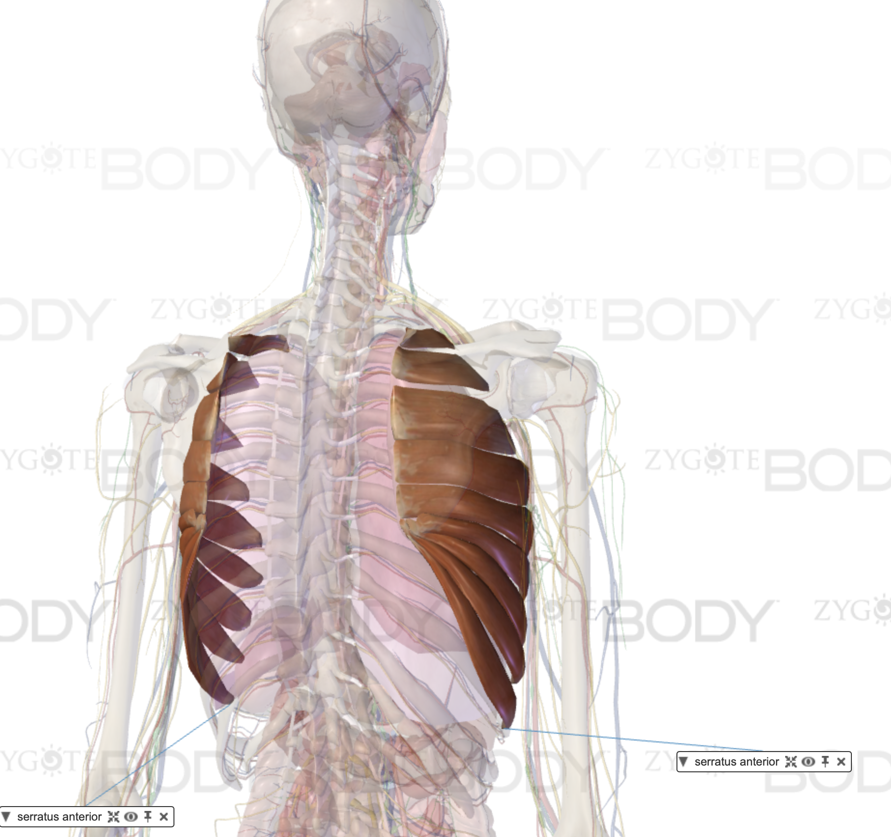

---

## 二、放松紧张的肌群

### 1. 菱形肌

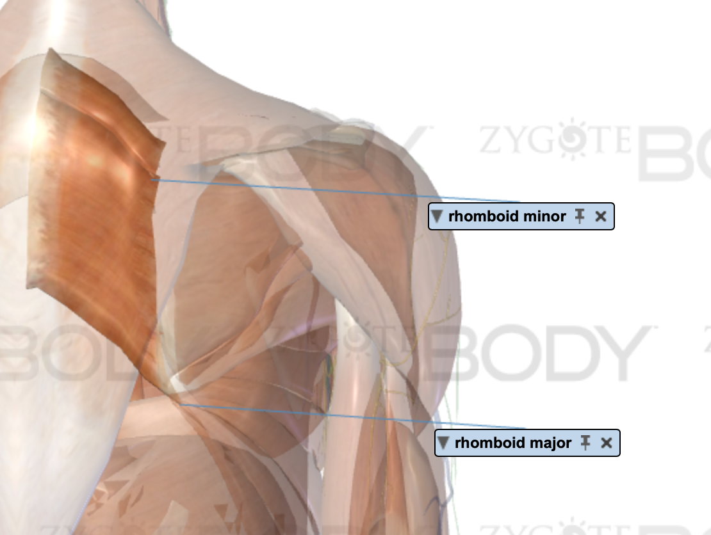

**放松方法**：腰靠墙，两手向前伸到最远端。

### 2. 肩胛提肌

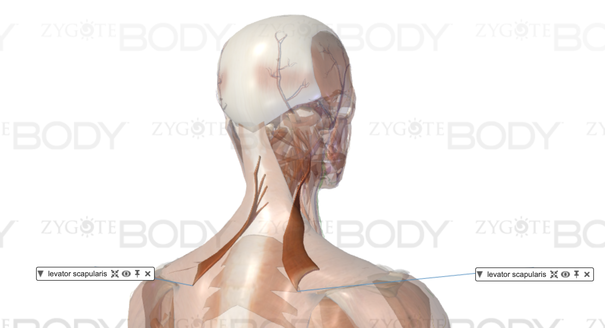

**放松方法**：头看向一侧裤子口袋，另一只手臂举起，让肩胛骨向上回旋。

---

## 三、其他影响前锯肌发力的肌群

除了菱形肌和肩胛提肌，**内旋肌群**紧张也可能让前锯肌没有发力感：

- **肩胛下肌、背阔肌、胸小肌** —— 紧张时主要导致圆肩、肱骨内旋

### 1. 拉伸背阔肌

背阔肌起点在大臂后侧，终点延伸到髋部。根据走向，拉伸要点：

1. 抬高手臂位置
2. 向后坐
3. 身体向外旋转，增加与脊柱肌肉的距离
4. 顶髋，进一步加大拉伸

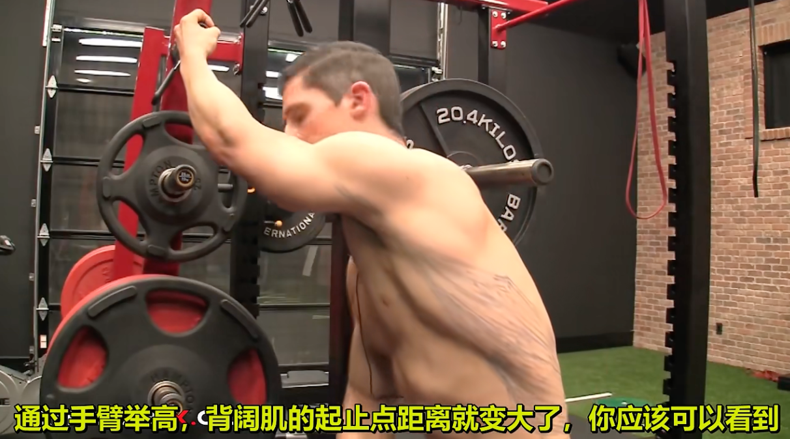

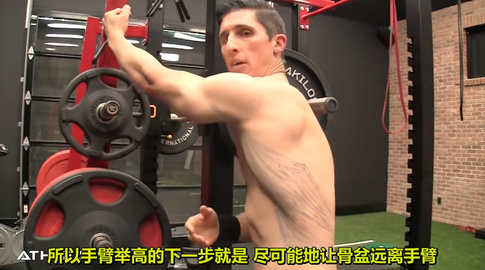

### 2. 拉伸肩胛下肌

肩胛下肌属于肩袖肌群。肩袖四块肌肉中，冈上肌、冈下肌、小圆肌负责**外旋**，只有肩胛下肌负责**内旋**。

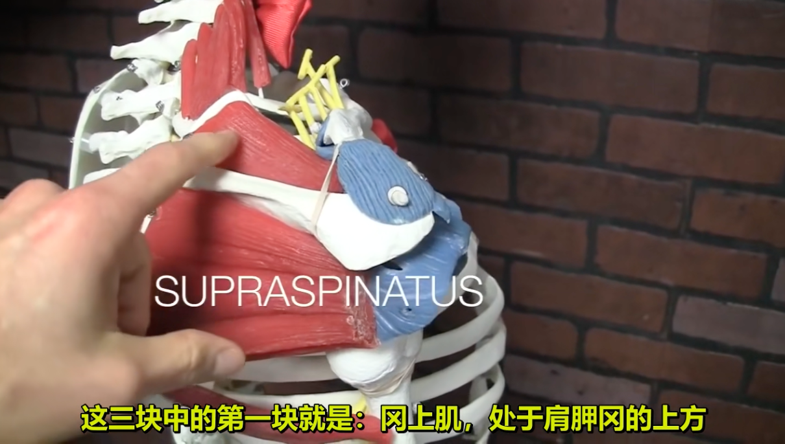

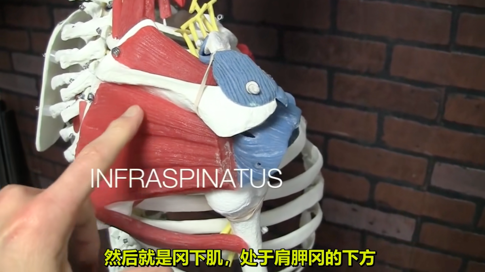

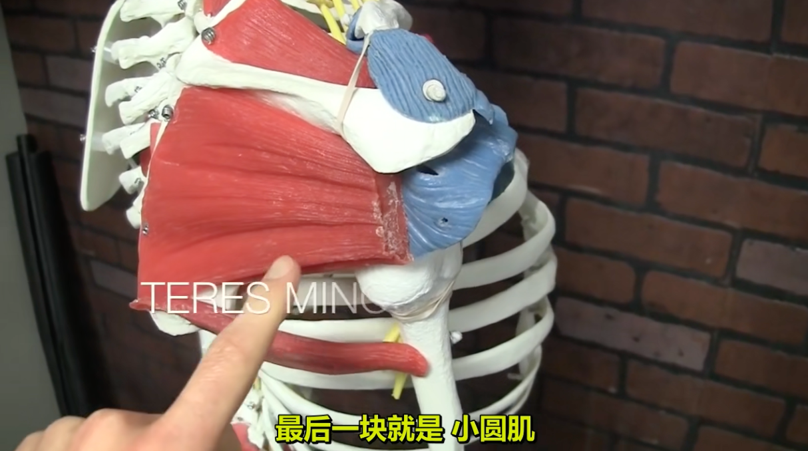

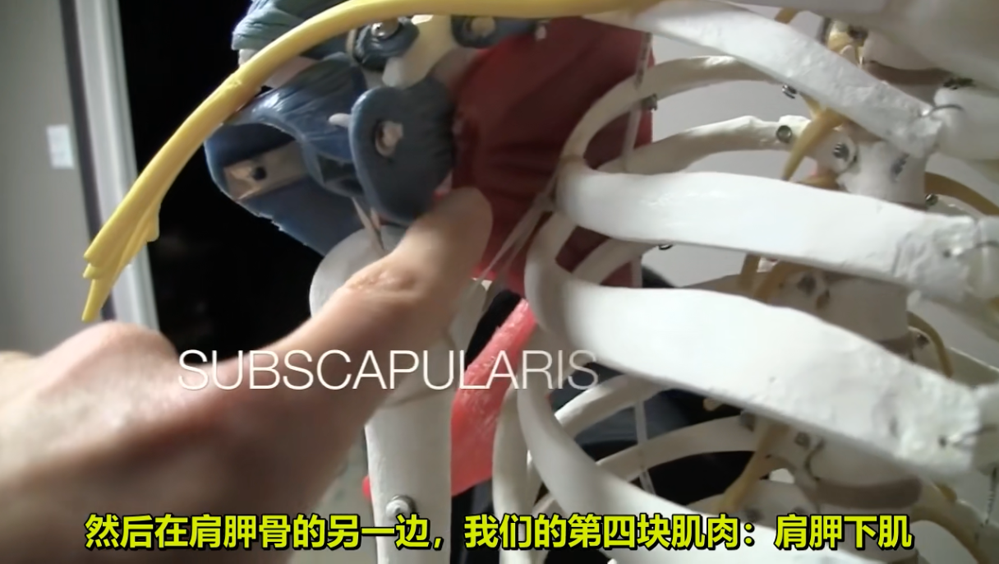

**拉伸方法**：手抓棍子，大臂与身体、大臂与小臂均成 90°，三者保持在同一平面，棍子自然下垂，另一只手握住棍子另一端向后推。

### 3. 拉伸胸大肌、胸小肌

胸大肌和胸小肌的走向：

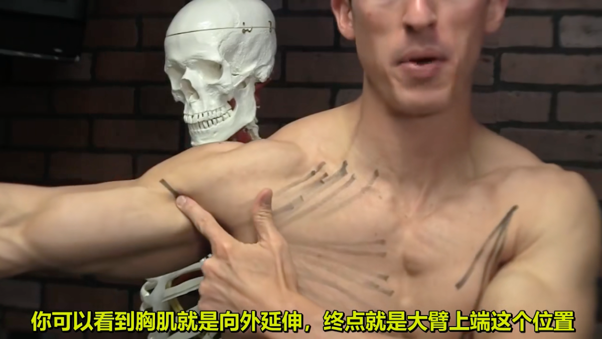

**拉伸方法**：靠墙，手肘向上打开。⚠️ 注意不要出现肱骨前移。

---

## 四、前锯肌激活训练

完成放松和拉伸后，用以下动作增强前锯肌的发力感。

### 1. 摘苹果

使用弹力带或背对龙门架，从下向上前伸肩胛，像伸手摘苹果一样。

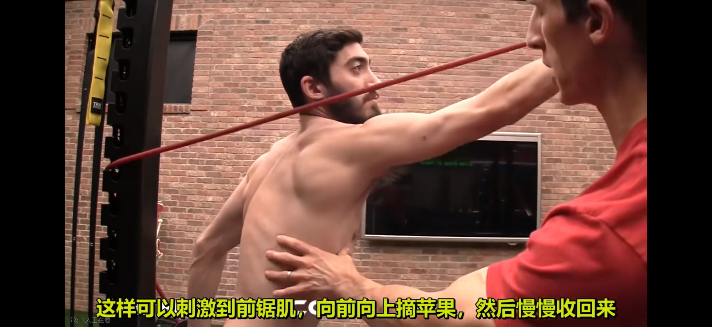

### 2. 后坐俯卧撑

跪姿俯卧撑，肩胛骨前伸把上背部撑满；保持推地发力的同时向后坐，感受前锯肌发力。

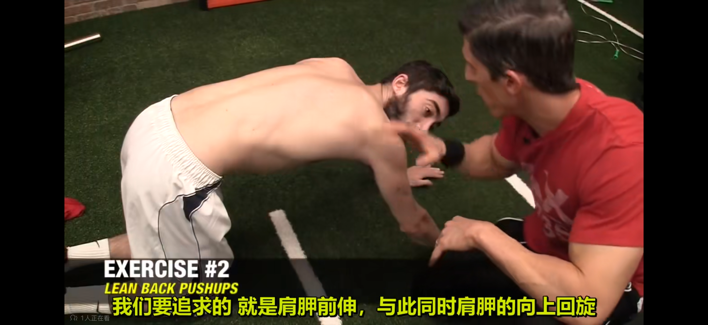

### 3. 弹力带拉开

肩胛微微前伸的状态下拉开弹力带。

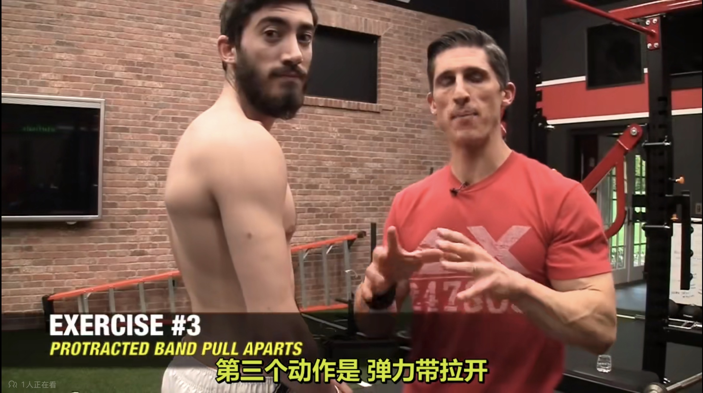

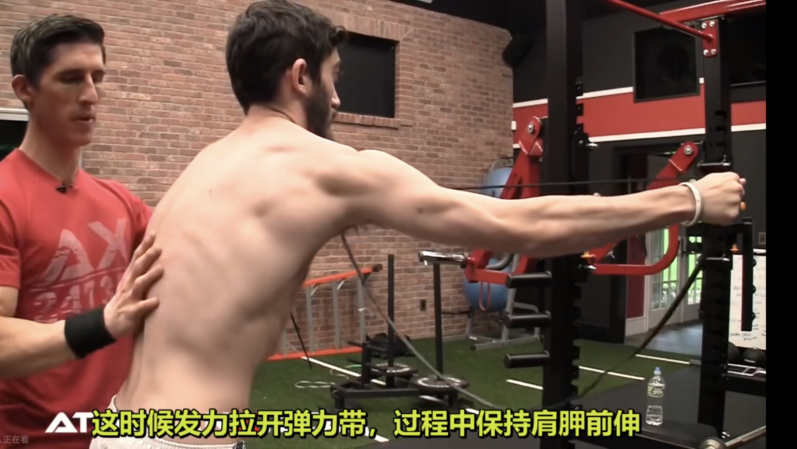

### 4. 钻墙

肩胛前伸，握拳、手臂垂直于墙壁，做内旋钻墙动作。

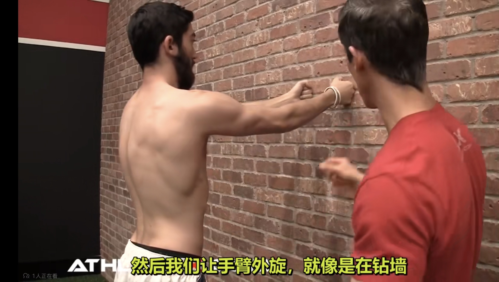

### 5. 臂屈伸顶端保持

臂屈伸在最高点前伸肩胛骨，然后保持。

### 6. 直臂下压

肩胛骨微微前伸的姿态下做直臂下压。

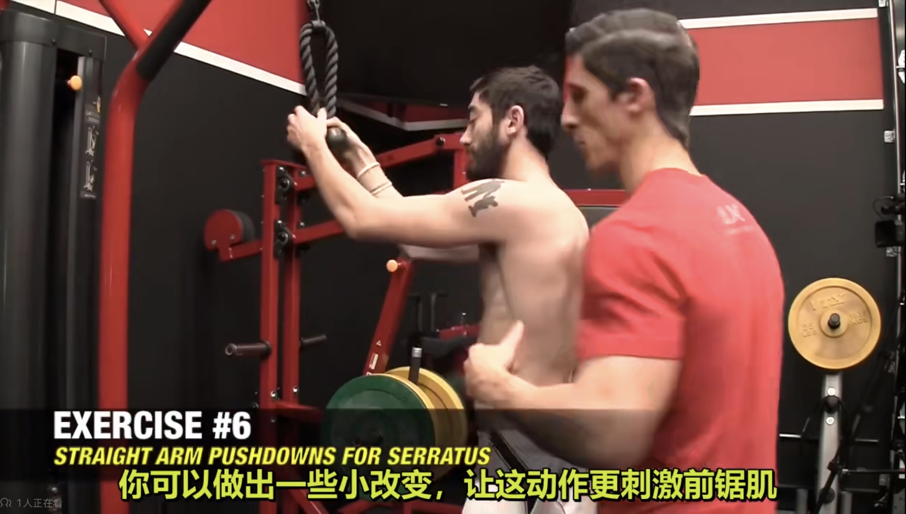

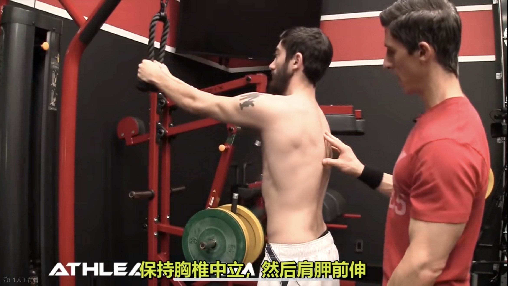

---

这份方案也整理了适合打印的排版版本：

[📄 下载打印版 PDF](/files/%E7%BF%BC%E7%8A%B6%E8%82%A9%E8%83%9B-apple.pdf)
