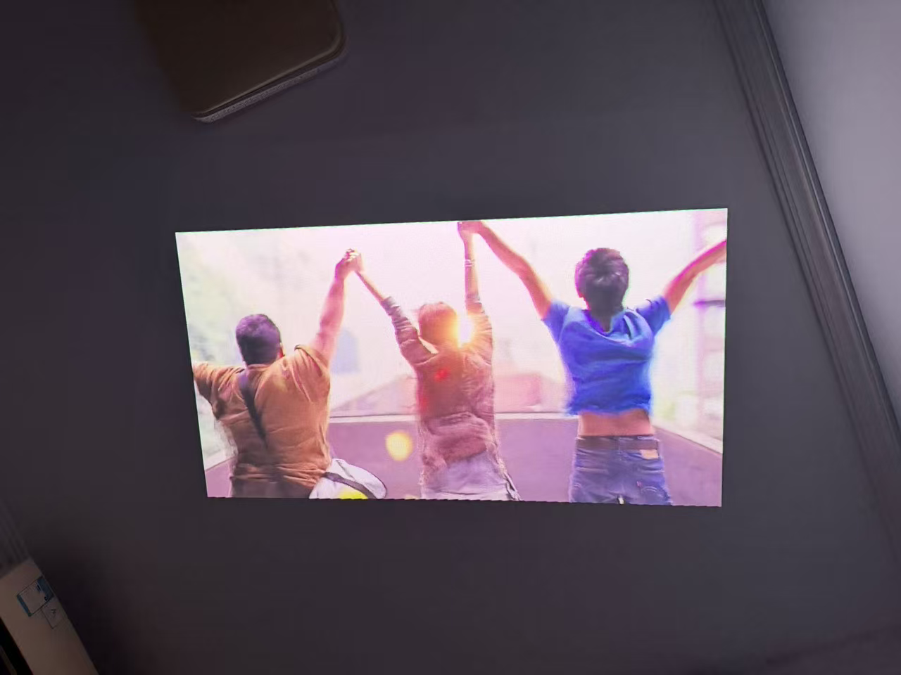

（复制这个文件，文件名改成电影名，改好 frontmatter 后把 publish 改成 true）

- `rating`：5 星制，支持半星（如 4.5）
- `date`：看完的日期
- 海报：直接在下面粘贴图片，**第一张图自动成为看板海报**（不会在正文重复显示）；想用别的图当海报就在 frontmatter 加 `cover: 图片名.png`

在这里粘贴海报 / 剧照，然后写心得——一句话也行。

周三晚，打完球回到小屋肉体非常疲惫了精神却不得安静。
南山、丁波和肥皂。千禧年的妆造、画质和故事，让你觉得生活好像本来就是在一个宁静的小县城像三和大神那样找一份工作过日子，爬上敞开的火车车厢就走向大山，三个人就可以抵御全世界。
我喜欢他们坐在火车上吹风的长镜头。不见阳光也没有雨水的天气里永远被浓雾笼罩的观音山在火车车厢背后只剩残影，自由与不安一同扑面而来。
儿子出事的车修好了、他们一同去了许多地方、四个人成为了世界上可以互相依赖的人，但常老师最终还是消失在观音山里了。她想不明白、其实谁又想得明白。